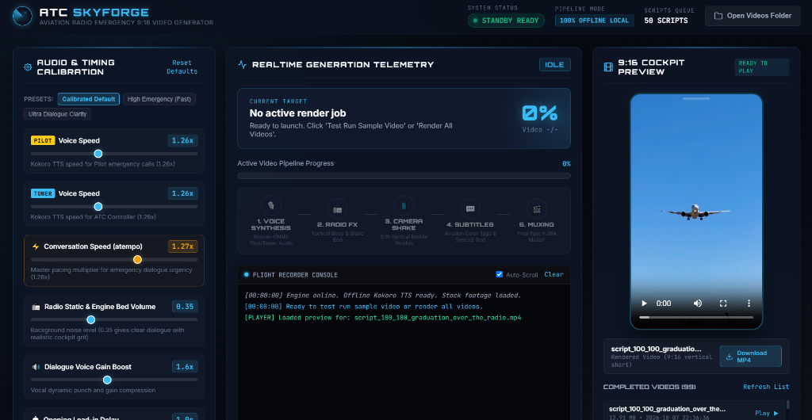
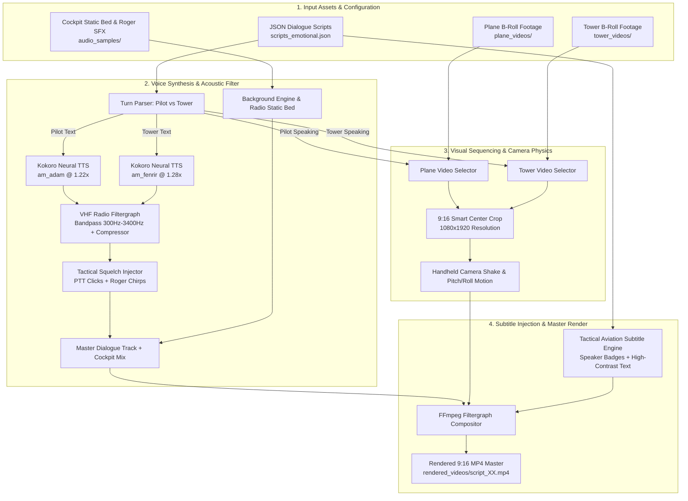

# ✈️ ATC SkyForge — Aviation Radio Emergency 9:16 Video Generator

<div align="center">

[](https://www.python.org/)
[](https://fastapi.tiangolo.com/)
[](https://ffmpeg.org/)
[](https://modal.com/)
[](https://huggingface.co/hexgrad/Kokoro-82M)
[](https://github.com/mianshahid-official/atc-skyforge)
[](LICENSE)

**Autonomous AI pipeline for generating viral 9:16 short-form videos of high-stakes Pilot & Air Traffic Control emergency radio communications with realistic VHF acoustics, tactile squelch, handheld camera shake, and synchronized subtitles.**

[Features](#-key-features) • [Screenshot](#-cockpit-interface) • [Architecture](#-system-architecture) • [Quick Start](#-quick-start) • [Cloud GPU Pipeline](#-modal-cloud-batch-pipeline) • [Script Format](#-dialogue-script-schema) • [License](#-license)

</div>

---

## 🖥️ Cockpit Interface

<div align="center">
  
  <p><em>ATC SkyForge Desktop Mission Control — Realtime generation telemetry, audio & timing calibration, 9:16 cockpit preview player, and automated flight recorder console.</em></p>
</div>

---

## 📖 Executive Summary

**ATC SkyForge** is a specialized video synthesis suite engineered specifically for creating compelling 9:16 vertical videos (YouTube Shorts, Instagram Reels, TikTok) centered around dramatic, emergency, and emotional aviation radio dialogues.

The engine orchestrates **Neural Text-to-Speech (Kokoro-82M)**, **VHF radio acoustic signal processing**, **intelligent B-roll camera switching** (cockpit/aircraft footage for the pilot, control tower/radar footage for the controller), **handheld camera wobble simulation**, and **high-contrast aviation tactical subtitles** with callsign color badges.

### Why ATC SkyForge?
- **Zero Manual Video Editing**: Input structured JSON conversation scripts and receive broadcast-ready 1080x1920 MP4 masters.
- **True VHF Radio Acoustics**: Eliminates artificial text-to-speech tone using bandpass filters (300 Hz – 3400 Hz), push-to-talk (PTT) mic clicks, dual-tone tactical Roger beeps, and cockpit engine ambient beds.
- **Dual Runtime Capabilities**:
  1. **100% Offline Local Desktop GUI**: Powered by FastAPI + PyWebView and local ONNX neural weights with zero internet dependency.
  2. **Serverless Cloud GPU Pipeline (Modal)**: Warm NVIDIA T4 GPU batch rendering delivering finished videos in ~15 seconds each with automatic chunked downloading.

---

## 🌟 Key Features

| Capability | Description |
| :--- | :--- |
| **🎙️ Dual Neural Voices** | Distinct voice profiles for Pilot (`am_adam`, urgent/strained) and ATC Tower (`am_fenrir`, calm/authoritative). |
| **📻 Realistic VHF Radio Physics** | 300Hz–3400Hz bandpass filter, dynamic audio compression, PTT key clicks, tactical Roger chirps, and realistic cockpit background grit. |
| **⚡ Conversation Speed Control** | Precision timing calibration with `atempo` pacing multipliers for heightened emergency urgency. |
| **🎥 Speaker-Aware B-Roll Switching** | Automatically selects plane/cockpit footage when the Pilot transmits and control tower/radar footage when the Controller responds. |
| **📱 9:16 Vertical Video Master** | Automatically center-crops any stock footage to vertical 1080x1920 with zero black bars. |
| **📳 Handheld Mobile Wobble** | Adds dynamic, realistic handheld camera shake and gentle organic pitch/roll tilt to simulate cockpit tension. |
| **💬 Tactical Color-Coded Subtitles** | Synced subtitles featuring aviation color tags (`PILOT` badge in gold, `TOWER` badge in cyan) and clean drop-shadow typography. |
| **☁️ High-Efficiency Cloud Batches** | Modal serverless GPU backend that renders hundreds of videos in warm batches without container spin-down delays. |

---

## 🏗️ System Architecture



---

## 🚀 Quick Start

### 1. Prerequisites
- **Python**: Version 3.10 or higher.
- **FFmpeg**: Installed and accessible in your system PATH (`ffmpeg -version`).
- **Operating System**: Windows, Linux, or macOS.

### 2. Installation

Clone this repository and install dependencies:

```bash
git clone https://github.com/mianshahid-official/atc-skyforge.git
cd atc-skyforge
pip install -r requirements.txt
```

*(Windows users can simply double-click `install_requirements.bat`)*

### 3. Setup Stock B-Roll Videos

Place stock video clips (`.mp4`, `.mov`, `.mkv`) in the designated directories:
- `plane_videos/`: Airplane, cockpit, airborne, or cabin exterior clips.
- `tower_videos/`: Air traffic control tower, radar screens, runway tarmac, or airport grounds.

*(Any 16:9 or 9:16 resolution is accepted; the engine automatically crops and centers footage to 1080x1920).*

### 4. Setup Optional Stock Video Downloader (Pixabay)

To automatically fetch aviation stock clips via the included downloader:
1. Copy `api_keys.example.txt` to `api_keys.txt`.
2. Add your free [Pixabay API Key](https://pixabay.com/api/docs/):
   ```ini
   PIXABAY_API_KEY=your_pixabay_key_here
   ```
3. Run the automated downloader:
   ```bash
   python pixabay_downloader.py
   ```

---

## 🕹️ Running the Application

### Option A: Standalone Native Desktop App (Recommended)
Launches the dark-themed cockpit interface in a dedicated desktop window:

```bash
python desktop_app.py
```
*(Or double-click `run.bat` on Windows)*

### Option B: Local Web Server Mode
Runs the local cockpit server and opens in your preferred web browser:

```bash
python server.py
```
*(Or double-click `start_ui.bat` — opens at `http://localhost:5000`)*

### Option C: Headless Command Line Interface (CLI)
Render individual or batch scripts directly from the terminal:

```bash
# Render a single script from JSON
python atc_generator.py --json scripts_emotional.json --index 0

# Render with custom speech rates
python atc_generator.py --json scripts_emotional.json --index 0 --pilot-speed 1.25 --tower-speed 1.30
```

---

## ☁️ Modal Cloud Batch Pipeline

ATC SkyForge includes production-grade serverless cloud support via [Modal](https://modal.com/), enabling you to render hundreds of videos in parallel on NVIDIA GPUs with zero local hardware strain.

### 1. Setup Modal
```bash
pip install modal
modal setup
```

### 2. Create the Persistent Asset Volume
```bash
modal volume create atc-assets
```

### 3. Sync Assets & Scripts to Modal
```bash
# Upload stock videos
python upload_all_assets.py

# Upload conversation scripts
modal volume put -f atc-assets scripts_emotional.json /scripts_emotional.json

# Upload cockpit audio bed
modal volume put atc-assets audio_samples/04_background_radio_static.wav /audio_samples/04_background_radio_static.wav
```

### 4. Deploy the Cloud Backend
```bash
modal deploy modal_app.py
```

### 5. Render & Download in Warm Batches
Render unrendered scripts in high-efficiency batches of 10 without container sleep or cold starts:

```bash
python render_unrendered_only.py --batch-size 10
```

#### Cloud CLI Commands & Options:
```bash
# Process only the next 10 scripts
python render_unrendered_only.py --limit 10

# Dry-run preview without rendering
python render_unrendered_only.py --dry-run

# Specify custom Modal Web API URL
python render_unrendered_only.py --url https://<your-workspace>--atc-video-generator-api.modal.run
```

### 6. One-Command Script Replacement & Batch Render
Whenever you have a new set of scripts (e.g. `scripts_201_300.json`):

```bash
# Uploads to Modal cloud volume and renders in warm batches of 10
python render_new_scripts.py scripts_201_300.json --batch-size 10
```
*(Or double-click `render_new_scripts.bat` on Windows for interactive selection!)*

This automatically:
1. Validates the local JSON script schema.
2. Replaces `/scripts_emotional.json` on the Modal persistent volume.
3. Renders all new scripts on warm NVIDIA T4 GPU in batches of X.
4. Streams and downloads finished 9:16 vertical MP4s into `rendered_videos/`.

---

## 📝 Dialogue Script Schema

Scripts are loaded from `scripts_emotional.json` (or `scripts.json`). The engine supports flexible script titles and alternating speaker turns:

```json
[
  {
    "title": "01_emergency_dual_engine_flameout",
    "dialogue": [
      {
        "speaker": "Pilot",
        "text": "Mayday, Mayday, Mayday! SkyForge 415, both engines have flamed out after bird strike at eight thousand feet!"
      },
      {
        "speaker": "Tower",
        "text": "SkyForge 415, Tower roger Mayday, squawk 7700. Wind calm, all runways available, turn heading two seven zero immediately."
      },
      {
        "speaker": "Pilot",
        "text": "We are attempting relight on engine two, currently gliding through six thousand feet heading two five zero."
      },
      {
        "speaker": "Tower",
        "text": "SkyForge 415, radar contact four miles east. Runway two eight Right is cleared for emergency landing, crash trucks dispatched."
      },
      {
        "speaker": "Pilot",
        "text": "Tower, engine two restart failed. We have the airfield in sight, gear is gravity extending."
      },
      {
        "speaker": "Tower",
        "text": "SkyForge 415, you are cleared to land any runway or taxiway, airport is completely yours, godspeed."
      }
    ]
  }
]
```

### Supported Speaker Identifiers:
- **Pilot**: `"Pilot"`, `"pilot"`, `"captain"`, `"cockpit"`, `"aircraft"`
- **Tower**: `"Tower"`, `"tower"`, `"atc"`, `"ground"`, `"approach"`, `"center"`, `"radar"`

---

## 📁 Repository Structure

```
atc-skyforge/
├── audio_samples/                   # Cockpit background noise & tactical Roger beeps
│   ├── 03_roger_beep_tactical.wav
│   └── 04_background_radio_static.wav
├── docs/                            # Documentation assets
│   └── screenshot.png               # Cockpit interface showcase
├── models/                          # Neural TTS model directory
│   ├── kokoro/                      # Kokoro-82M ONNX model & voice bins
│   └── piper/                       # Optional Piper neural voice models
├── plane_videos/                    # Stock airplane & cockpit B-roll footage
│   └── README.txt
├── tower_videos/                    # Stock ATC tower & radar screen B-roll footage
│   └── README.txt
├── rendered_videos/                 # Output directory for rendered 9:16 master MP4s
├── web/                             # Dark-themed tactical cockpit web interface
│   ├── index.html                   # Mission control telemetry dashboard
│   ├── style.css                    # Aviation HUD styling & animations
│   └── app.js                       # Realtime websocket & HTTP telemetry controller
├── api_keys.example.txt             # Template for external API keys
├── atc_generator.py                 # Core FFmpeg & acoustic rendering pipeline
├── desktop_app.py                   # Standalone desktop application launcher
├── install_requirements.bat         # Automated Windows dependency installer
├── modal_app.py                     # Serverless Cloud GPU application (NVIDIA T4)
├── modal_kokoro_tts.py              # Standalone Kokoro TTS Modal service
├── modal_qwen_tts.py                # Standalone Qwen3 TTS Modal service
├── pixabay_downloader.py            # Automated vertical stock video downloader
├── render_and_download_all.py       # Modal 2-phase full batch render & download
├── render_new_scripts.bat           # Double-click script deployer & batch runner (Windows)
├── render_new_scripts.py            # One-command script replacement & GPU batch renderer
├── render_unrendered_only.py        # Smart delta batch renderer for missing videos
├── requirements.txt                 # Python dependencies
├── run.bat                          # Double-click desktop launcher (Windows)
├── scripts_emotional.json           # Active dialogue scripts queue (sample data)
├── scripts.json                     # Local fallback dialogue scripts
├── server.py                        # FastAPI telemetry backend & video streamer
├── start_ui.bat                     # Double-click web browser launcher (Windows)
├── trim_and_rename_videos.py        # Utility to normalize & trim stock footage
└── upload_all_assets.py             # Smart delta sync of stock assets to Modal volume
```

---

## ⚙️ Audio Calibration & Telemetry Controls

The interface exposes real-time telemetry parameters to fine-tune pacing and acoustics:

| Parameter | Default | Range | Description |
| :--- | :---: | :---: | :--- |
| **Pilot Voice Speed** | `1.22x` | 0.8x – 2.0x | Kokoro TTS speech velocity for emergency cockpit calls. |
| **Tower Voice Speed** | `1.28x` | 0.8x – 2.0x | Kokoro TTS speech velocity for ATC ground/tower controllers. |
| **Conversation Speed (`atempo`)** | `1.26x` | 0.8x – 2.0x | Master conversation pacing multiplier for heightened tension. |
| **Cockpit Engine & Static Volume** | `0.35` | 0.0 – 1.0 | Ambient background VHF static and engine rumble bed. |
| **Dialogue Voice Gain Boost** | `1.6x` | 0.5x – 3.0x | Audio dynamic punch and vocal gain compression. |
| **Opening Lead-In Delay** | `1.0s` | 0.0s – 3.0s | Ambient runway/engine silence before first radio key-in. |

---

## 🤝 Contributing

Contributions, bug reports, and feature requests are welcome!
1. Fork the Project (`https://github.com/mianshahid-official/atc-skyforge`)
2. Create your Feature Branch (`git checkout -b feature/AmazingFeature`)
3. Commit your Changes (`git commit -m 'Add some AmazingFeature'`)
4. Push to the Branch (`git push origin feature/AmazingFeature`)
5. Open a Pull Request

---

## 📜 License

Distributed under the MIT License. See `LICENSE` for more information.

---

<div align="center">
  <b>Built for aviation content creators and video automation engineers.</b><br/>
  Crafted by <a href="https://github.com/mianshahid-official">@mianshahid-official</a>
</div>
